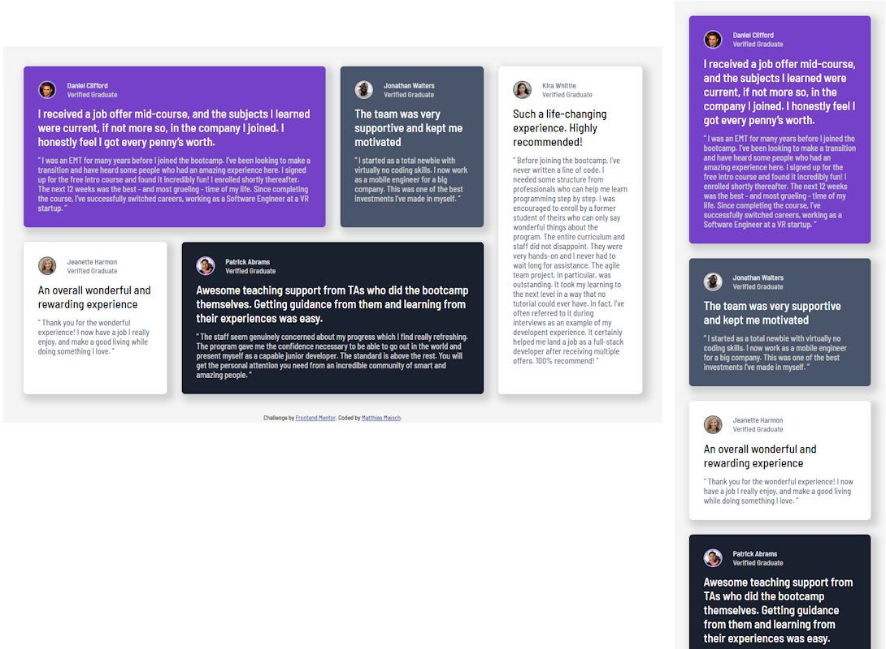

# Frontend Mentor - Testimonials grid section solution

This is a solution to the [Testimonials grid section challenge on Frontend Mentor](https://www.frontendmentor.io/challenges/testimonials-grid-section-Nnw6J7Un7). Frontend Mentor challenges help you improve your coding skills by building realistic projects. 

## Table of contents

- [Overview](#overview)
  - [The challenge](#the-challenge)
  - [Screenshot](#screenshot)
  - [Links](#links)
- [My process](#my-process)
  - [Built with](#built-with)
  - [What I learned](#what-i-learned)
  - [Continued development](#continued-development)
- [Author](#author)

## Overview

### The challenge

Users should be able to:

- View the optimal layout for the site depending on their device's screen size

### Screenshot

### Links

- Solution URL: [github.com/solloc/frontend-mentor-testimonials-grid](https://github.com/solloc/frontend-mentor-testimonials-grid)
- Live Site URL: [solloc.github.io/frontend-mentor-testimonials-grid](https://solloc.github.io/frontend-mentor-testimonials-grid/)

## My process

### Built with

- Semantic HTML5 markup
- Flexbox
- CSS Grid
- Mobile-first workflow

### What I learned

I tested a few different variants for breakpoints and widths of components. Both mobile and desktop design still resize, so it's not a complete hard break between the two. 

### Continued development

I most likely won't continue with this challenge, but I guess the responsiveness can be further optimized to allow a more fluid flow between the extremes.

## Author

- Website - [novaImpact](https://www.novaimpact.com)
- Frontend Mentor - [@solloc](https://www.frontendmentor.io/profile/solloc)
- X - [@sollloc](https://x.com/sollloc)
